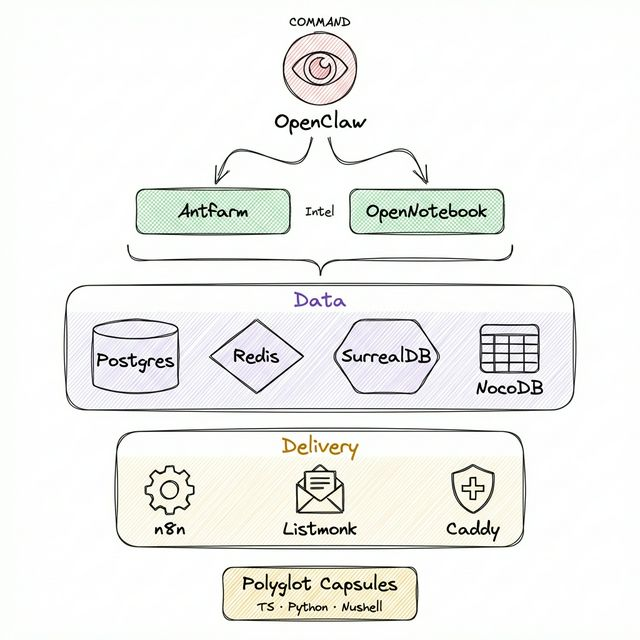
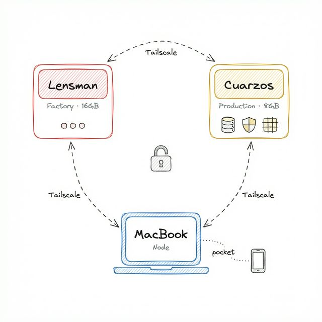

<div align="center">


# The Quarzos Project

**A complete back office — deployed, running, and managed from your phone.**

Built for small business owners who need real infrastructure without an IT department.

---


</div>

---

## The Problem

Small business owners run on hustle — not dashboards.

They need to capture ideas while walking, send campaigns while commuting, and check on their business from wherever they are. But the tools that do these things are scattered across a dozen SaaS subscriptions, none of them talk to each other, and none of them were designed for someone who runs a crystal shop *and* an investment firm.

**The Quarzos Project** is proof that a single, self-hosted stack can replace all of it — for €20/month.

---

## What It Does

| Step | What Happens |
|------|-------------|
| **Capture** | Voice notes, chat messages, and quick inputs go in through the phone |
| **Route** | The Daemon figures out what you meant and sends it to the right tool |
| **Execute** | AI agents run the task — research, draft, update, notify — with guardrails |
| **Store** | Everything gets indexed into a searchable knowledge base |
| **Manage** | Contacts, leads, and data live in a no-code spreadsheet you actually control |
| **Automate** | Workflows connect everything — 400+ integrations, zero manual handoffs |

One input. Six layers of work. All from your pocket.

---

## Architecture

<div align="center">

</div>

<br/>

The stack is organized into functional layers:

| Layer | What It Does | Key Tools |
|-------|-------------|-----------|
| **Gateway** | TLS, routing, caching | Caddy, Redis |
| **Brain** | Intent routing, orchestration | Daemon, Control UI |
| **Knowledge** | RAG search, document processing, task management | Archon (6 microservices) |
| **Data** | CRM, structured data, auth, storage | NocoDB, PostgreSQL |
| **Research** | Notes, PDFs, video/audio processing, podcasts | OpenNotebook, SurrealDB |
| **Queue** | Agent dispatch, task execution | RabbitMQ, Agent Executor |
| **Automation** | Workflow engine, integrations | n8n |

**31 containers. One compose file. One server.**

---

## Infrastructure

<div align="center">

</div>

<br/>

| Node | Role | Spec |
|------|------|------|
| **Production Server** | Hosts the full stack | 8 GB RAM, ARM64 |
| **Factory Server** | Build, test, CI/CD | 16 GB RAM, x86 |
| **Dev Node** | Local development, mobile access | Laptop + phone |

All nodes connected via encrypted mesh network. The phone is the input device — frictionless capture, notifications, and control from wherever you are.

---

## Range

The same stack serves fundamentally different businesses:

<table>
<tr>
<th></th>
<th>Main Street</th>
<th>Wall Street</th>
</tr>
<tr>
<td><strong>Business</strong></td>
<td>Retail — crystals, minerals, specialty coffee</td>
<td>Investor relations firm</td>
</tr>
<tr>
<td><strong>CRM</strong></td>
<td>Walk-in customers, local events, inventory</td>
<td>Investor contacts, deal pipeline, compliance</td>
</tr>
<tr>
<td><strong>Automation</strong></td>
<td>Appointment reminders, restock alerts, social media</td>
<td>Report distribution, meeting prep, follow-ups</td>
</tr>
<tr>
<td><strong>Knowledge</strong></td>
<td>Product catalogs, supplier research, pricing</td>
<td>Market analysis, regulatory filings, due diligence</td>
</tr>
<tr>
<td><strong>Email</strong></td>
<td>Event invites, loyalty updates, new arrivals</td>
<td>Quarterly reports, LP communications, deal memos</td>
</tr>
</table>

One stack. Two worlds. That's the point.

---

## What's Under the Hood

### Built With

All open-source. All self-hosted. No vendor lock-in.

- **[Archon](https://github.com/coleam00/Archon)** — Knowledge engine with RAG search, document processing, and AI agent orchestration
- **[NocoDB](https://github.com/nocodb/nocodb)** — Open-source Airtable alternative for CRM and structured data
- **[OpenNotebook](https://github.com/lfnovo/open-notebook)** — Privacy-first research and note-taking with multi-model AI
- **[n8n](https://github.com/n8n-io/n8n)** — Workflow automation with 400+ integrations and native AI
- **[Supabase](https://github.com/supabase/supabase)** — PostgreSQL with Auth, Storage, and Realtime
- **[Caddy](https://github.com/caddyserver/caddy)** — Automatic HTTPS reverse proxy
- **[Redis](https://github.com/redis/redis)** — Cache, memory, pub/sub
- **[RabbitMQ](https://github.com/rabbitmq/rabbitmq-server)** — Message queue for agent dispatch

---

## Current Status

All services deployed and running in production.

| Service | Status |
|---------|--------|
| Gateway (Caddy + Redis) | ● Live |
| Control Plane (Daemon + UI) | ● Live |
| Knowledge Engine (Archon, 6 services) | ● Live |
| CRM (NocoDB) | ● Live |
| Database (Supabase, 13 services) | ● Live |
| Research (OpenNotebook) | ● Live |
| Task Queue (RabbitMQ + Executor) | ● Live |
| Automation (n8n) | ● Live |
| Email (Listmonk) | ● Live |

---

## What This Repo Contains

This is a **showcase** — it documents the architecture, philosophy, and capabilities of the Quarzos Project without exposing proprietary configuration or credentials.

```
quarzos-project/
├── README.md          # This file
├── assets/            # Visual assets and diagrams
└── docs/              # Architecture and philosophy (coming soon)
```

For deployment inquiries or a live demo, reach out directly.

---

<div align="center">

*Built by hand. Runs from your pocket.*

</div>
