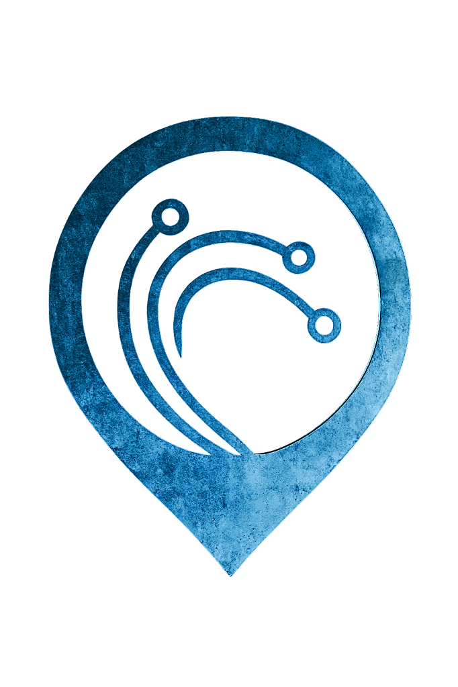
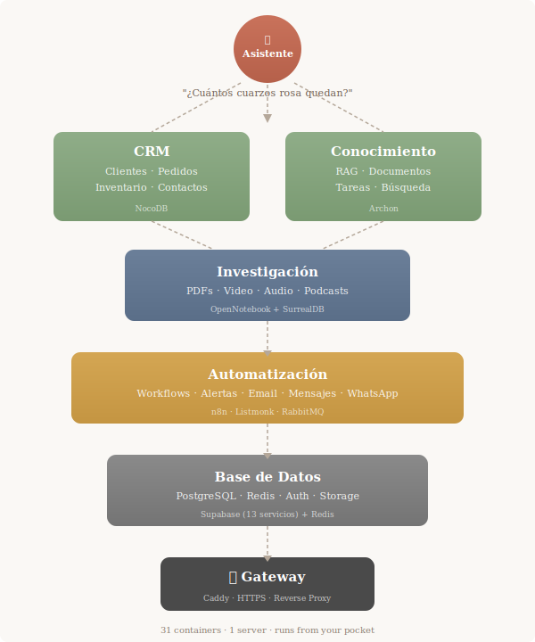

<div align="center">



# The Quarzos Project

**A complete back office for a small business — run from your phone.**

One server. One assistant. Everything a retail store needs to manage customers, orders, inventory, and communications — without an IT department.

[]()
[]()
[]()

<br/>


</div>

---

## The Situation

A retail store specializing in crystals, minerals, and specialty coffee. Walk-in customers, Instagram DMs, WhatsApp conversations, supplier relationships, and inventory that changes daily.

The owner manages everything from her phone and tablet. She doesn't use a terminal. She doesn't SSH into anything. She talks to her assistant — in Spanish — and things get done.

That assistant runs on a single server with 31 containers, handling:

| | |
|---|---|
| **Clientes** | Contacts, purchase history, follow-ups |
| **Pedidos** | Order tracking from inquiry to fulfillment |
| **Inventario** | Stock levels, restock alerts, supplier data |
| **Mensajes** | WhatsApp routing, Instagram DM handling |
| **Conocimiento** | Product catalogs, supplier research, market info |
| **Automatización** | Reminders, restock alerts, social media scheduling |

---

## How It Works

<div align="center">

</div>

<br/>

```
        📱  Phone / Tablet / Laptop
                    │
                    ▼
            ┌───────────────┐
            │   Asistente   │  "¿Cuántos cuarzos rosa quedan?"
            │   (Assistant) │  "12 en stock. ¿Quieres reabastecer?"
            └───────┬───────┘
                    │
            ┌───────▼───────┐
            │    Gateway    │  Routes intent → right tool
            └───────┬───────┘
                    │
        ┌───────────┼───────────┐
        │           │           │
        ▼           ▼           ▼
   ┌─────────┐ ┌─────────┐ ┌─────────┐
   │   CRM   │ │  Conoce  │ │  Auto   │
   │ Clientes│ │ miento   │ │ mación  │
   │ Pedidos │ │ Búsqueda │ │ Alertas │
   │   Inv.  │ │ Research │ │ Mensajes│
   └─────────┘ └─────────┘ └─────────┘
        │           │           │
        └───────────┼───────────┘
                    │
                    ▼
                📱 "Pedido creado ✓"
```

The owner asks a question or gives an instruction. The system figures out where it goes — CRM lookup, knowledge search, order update, or outbound message — and handles it.

---

## What's Running

| Layer | What It Does |
|-------|-------------|
| **Asistente** | Bilingual executive assistant with business domain guardrails |
| **CRM** | Customer records, orders, inventory via spreadsheet interface |
| **Conocimiento** | Document processing, RAG search, indexed business knowledge |
| **Investigación** | Product research, supplier analysis, notes, podcast generation |
| **Automatización** | Workflow engine — 400+ integrations for scheduling, alerts, routing |
| **Mensajería** | WhatsApp and Instagram DM handling, customer communication |
| **Base de Datos** | PostgreSQL with auth, storage, and realtime subscriptions |
| **Cola de Tareas** | Task dispatch with parallel agent workers for background processing |

---

## The Assistant

The assistant is purpose-built for this business. It:

- 🗣️ Speaks Mexican Spanish naturally
- 🎯 Knows which questions go to which database table
- ✋ Requires confirmation before sending any customer message
- 🔒 Cannot access banking, payment credentials, or server infrastructure
- 📋 Logs every action for audit
- 🧠 Learns from corrections overnight

It's not a general-purpose chatbot. It's a trained executive assistant with strict boundaries and a memory that gets better over time.

---

## The Tools

All open-source. All self-hosted. The owner's data never leaves the server.

---

### 📋 NocoDB
**The CRM — "Your Rolodex, but it Thinks"**

| | |
|---|---|
| **What it is** | Open-source Airtable alternative. Spreadsheet interface over PostgreSQL. |
| **Role in the stack** | Every customer, order, and inventory item lives here. The single source of truth for business data. |
| **Why it won** | The owner can browse her data the way she browses a spreadsheet — grid, gallery, kanban, calendar. No SQL required. The assistant queries it via API behind the scenes. |
| **Used for** | Customer contacts, purchase history, order tracking, inventory levels, supplier records. |

---

### 📚 Archon
**The Knowledge Engine — "The Reference Library"**

| | |
|---|---|
| **What it is** | RAG-powered knowledge base with document processing, vector search, and task management. Runs as 6 microservices. |
| **Role in the stack** | Intelligence layer. When the assistant needs to know something — a product spec, a supplier's lead time, a past conversation — it asks Archon. |
| **Why it won** | Handles the messy stuff: PDFs, web pages, scanned invoices. Indexes everything into searchable vectors. The assistant gets smarter with every document added. |
| **Used for** | Product catalog search, supplier research, document retrieval, task orchestration, agent coordination via MCP. |

---

### 📓 OpenNotebook
**The Research Desk — "A Quiet Room to Think"**

| | |
|---|---|
| **What it is** | Privacy-first research and note-taking with multi-model AI. Processes PDFs, video, audio, and web content. |
| **Role in the stack** | Deep research. When the assistant needs more than a quick lookup — competitor analysis, supplier comparison, trend research — it works here. |
| **Why it won** | Imports anything. Generates podcast-style audio summaries. The owner can listen to research while driving. Multi-notebook organization keeps projects separate. |
| **Used for** | Supplier analysis, product research, trend reports, audio summaries, long-form notes. |

---

### ⚙️ n8n
**The Workflow Engine — "The Wires Behind the Walls"**

| | |
|---|---|
| **What it is** | Visual workflow automation with 400+ integrations and native AI capabilities. |
| **Role in the stack** | Connects everything that needs to happen automatically. If A happens, do B. Every morning at 8, check C. |
| **Why it won** | Visual builder means the workflows are visible and debuggable. LangChain integration means AI can be a step in any workflow. Self-hosted means no Zapier bill and no data leaving the network. |
| **Used for** | Restock alerts, appointment reminders, social media scheduling, WhatsApp routing, Instagram DM handling, daily reports. |

---

### 🐘 Supabase
**The Foundation — "Everything Sits on This"**

| | |
|---|---|
| **What it is** | Self-hosted PostgreSQL with authentication, file storage, realtime subscriptions, and a REST API. Runs as 13 services. |
| **Role in the stack** | The foundation. Every other service stores its data here. Auth handles user sessions. Storage handles file uploads. Realtime pushes updates to the UI. |
| **Why it won** | One database for everything instead of five. pgvector for embeddings. PostgREST for instant APIs. The whole Firebase experience, but self-hosted and yours. |
| **Used for** | Primary data store, user authentication, file storage, real-time UI updates, vector embeddings. |

---

### 🐇 RabbitMQ + Agent Workers
**The Task Queue — "The Loading Dock"**

| | |
|---|---|
| **What it is** | Message queue with parallel agent workers. Tasks go in, results come out. Three workers running simultaneously. |
| **Role in the stack** | Background processing. When the assistant needs to do something that takes time — process a batch of invoices, send a series of messages — it drops it in the queue and moves on. |
| **Why it won** | Reliable delivery. If a worker crashes, the task retries. Parallel execution means three things happen at once. The owner never waits. |
| **Used for** | Bulk operations, background agent tasks, parallel processing, reliable task execution. |

---

### 🛡️ Caddy + Redis
**The Gateway — "The Front Door"**

| | |
|---|---|
| **What it is** | Caddy for automatic HTTPS and reverse proxy. Redis for session cache, conversation memory, and audit logging. |
| **Role in the stack** | Everything enters through Caddy. Every conversation is cached in Redis. Every action is logged for audit. |
| **Why it won** | Caddy handles TLS certificates automatically — no manual cert management. Redis gives the assistant instant memory recall and keeps conversation context alive across sessions. |
| **Used for** | HTTPS termination, service routing, conversation cache, session state, immutable audit trail. |

---

## Range

This same architecture has been deployed for two fundamentally different businesses:

| | Main Street | Wall Street |
|--|-------------|-------------|
| **Business** | Retail — crystals, minerals, specialty coffee | Investor relations firm |
| **Users** | Owner on phone/tablet, walk-in customers | Analysts, portfolio managers |
| **CRM** | Customer contacts, purchase history, events | Investor contacts, deal pipeline, compliance |
| **Automation** | Restock alerts, appointment reminders, social | Report distribution, meeting prep, follow-ups |
| **Knowledge** | Product catalogs, supplier research | Market analysis, regulatory filings |
| **Language** | Spanish | English |

One architecture. Two worlds. That's the point.

---

## Current Status

All services deployed and running in production.

| Service | Status |
|---------|--------|
| Gateway | 🟢 Live |
| Asistente | 🟢 Live |
| CRM | 🟢 Live |
| Knowledge Engine | 🟢 Live |
| Research | 🟢 Live |
| Automation | 🟢 Live |
| Database (PostgreSQL + 13 services) | 🟢 Live |
| Task Queue | 🟢 Live |
| Email | 🟢 Live |

---

## What This Repo Contains

This is a **showcase** — it documents what has been built without exposing configuration or credentials.

For deployment inquiries or a live walkthrough, reach out directly.

---

<div align="center">

*Built by hand. Runs from your pocket.*

</div>
